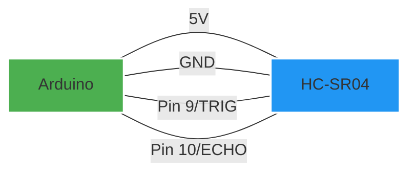
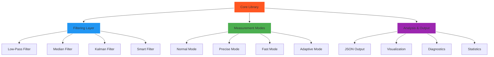
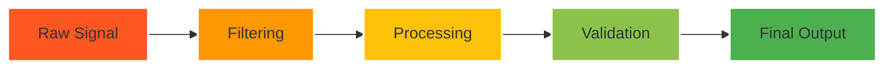
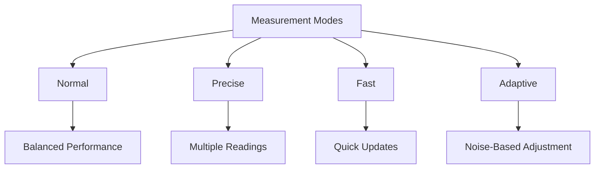
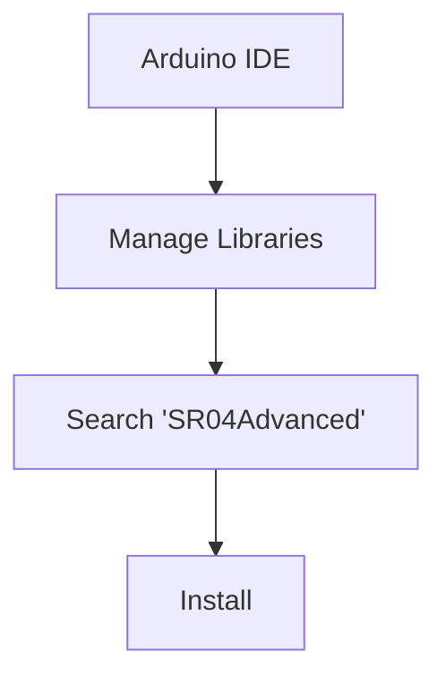
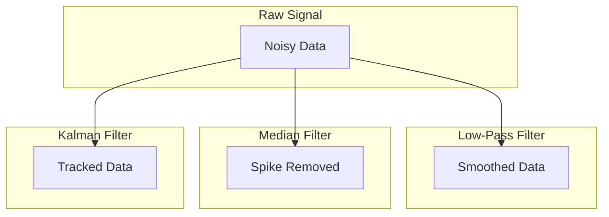
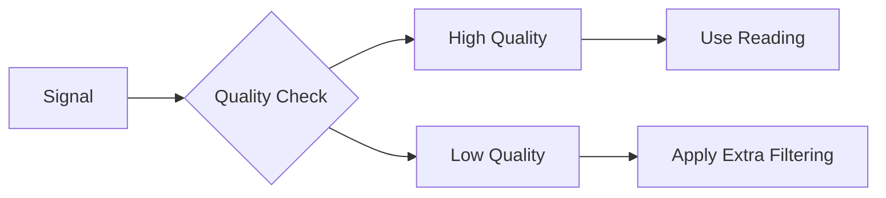
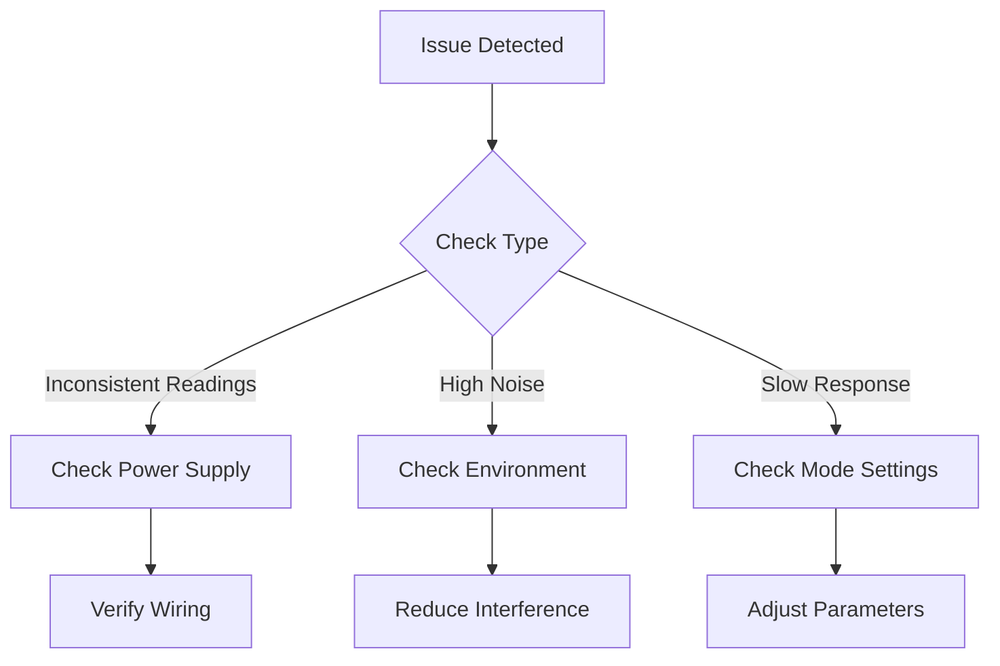

# SR04Advanced Library

<div align="center">
<h3>Advanced Ultrasonic Sensor Library with Smart Filtering</h3>
<p>Created by: Md Khairul Islam</p>
<p>Hobart and William Smith Colleges</p>
<p>Double major in Robotics and Computer Science</p>
</div>

## Quick Navigation
- [Overview](#overview)
- [Hardware Setup](#hardware-setup)
- [Features](#features)
- [Installation](#installation)
- [Usage Examples](#usage-examples)
- [API Reference](#api-reference)
- [Advanced Topics](#advanced-topics)
- [Troubleshooting](#troubleshooting)

## Overview

SR04Advanced is a sophisticated Arduino library that enhances HC-SR04 ultrasonic sensor measurements through advanced filtering, noise reduction, and intelligent processing techniques.

### Hardware Connection Diagram



### Library Architecture



### Signal Processing Flow



## Features

### Advanced Filtering
| Filter Type | Best For | Performance Impact |
|-------------|----------|-------------------|
| Low-Pass | Smooth, continuous measurements | Low |
| Median | Spike removal | Medium |
| Kalman | Precise tracking | High |
| Smart | Adaptive filtering | Medium-High |

### Measurement Modes


## Installation

### Method 1: Arduino Library Manager


### Method 2: Manual Installation
1. Download ZIP
2. Arduino IDE: Sketch > Include Library > Add .ZIP Library

## Basic Usage

```cpp
#include <SR04Advanced.h>

const int TRIGGER_PIN = 9;
const int ECHO_PIN = 10;

SR04Advanced sonar(TRIGGER_PIN, ECHO_PIN);

void setup() {
    Serial.begin(9600);
    sonar.begin();  // Auto-calibration enabled
}

void loop() {
    float distance = sonar.getSmartDistance();
    Serial.print("Distance: ");
    Serial.print(distance);
    Serial.println(" cm");
    delay(100);
}
```

## Filter Performance Visualization

Here's how different filters affect the sensor readings:



## Advanced Features

### Temperature Compensation
```cpp
// Update temperature for accurate measurements
sonar.setTemperature(25.0);  // 25°C
```

### Signal Quality Monitoring


## Performance Metrics

### Filter Comparison
| Filter Type | CPU Usage | Memory | Accuracy | Latency |
|-------------|-----------|---------|-----------|----------|
| None | ⭐ | ⭐ | ⭐ | ⭐⭐⭐ |
| Low-Pass | ⭐⭐ | ⭐⭐ | ⭐⭐ | ⭐⭐⭐ |
| Median | ⭐⭐ | ⭐⭐⭐ | ⭐⭐⭐ | ⭐⭐ |
| Kalman | ⭐⭐⭐ | ⭐⭐⭐ | ⭐⭐⭐ | ⭐⭐ |
| Smart | ⭐⭐⭐ | ⭐⭐⭐ | ⭐⭐⭐ | ⭐⭐ |

## Troubleshooting

### Common Issues Flowchart


## Contributing

1. Fork the repository
2. Create feature branch (`git checkout -b feature/AmazingFeature`)
3. Commit changes
4. Push to branch
5. Open Pull Request

## Support and Contact

- GitHub Issues: [Open Issue](https://github.com/yourusername/SR04Advanced/issues)
- Email: [your.email@example.com]

## License

This project is licensed under the MIT License - see the [LICENSE](LICENSE) file for details.

---
Made with 💡 by Md Khairul Islam
