# SR04Advanced Library

<div align="center">
<h2>Advanced HC-SR04 Ultrasonic Sensor Library with Smart Filtering</h2>
<p>Created by: Md Khairul Islam</p>
<p>Hobart and William Smith Colleges</p>
<p>Double major in Robotics and Computer Science</p>
</div>

## Table of Contents
- [Overview](#overview)
- [System Architecture](#system-architecture)
- [Hardware Setup](#hardware-setup)
- [Installation](#installation)
- [Basic Usage](#basic-usage)
- [Advanced Features](#advanced-features)
- [Measurement Modes](#measurement-modes)
- [Signal Processing](#signal-processing)
- [Troubleshooting](#troubleshooting)

## Overview
The SR04Advanced library transforms the basic HC-SR04 ultrasonic sensor into a highly accurate and reliable distance measurement system. By implementing sophisticated filtering algorithms and intelligent processing techniques, this library significantly improves measurement accuracy and stability compared to standard implementations.

## Why This Library?

Traditional HC-SR04 readings often suffer from:
- Noisy measurements
- Inconsistent readings
- Temperature-related inaccuracies
- Limited functionality
- Spike errors
- Poor performance in challenging environments

SR04Advanced solves these issues through:
- Advanced filtering techniques
- Temperature compensation
- Multiple measurement modes
- Real-time quality assessment
- Intelligent error detection
- Adaptive processing

## Key Innovations

### 1. Smart Filtering System
Our multi-layer filtering approach combines three powerful techniques:
- **Spike Removal**: Eliminates sudden, unrealistic changes in readings
- **Noise Reduction**: Smooths out measurement variations
- **Smart Tracking**: Predicts and validates measurements for optimal accuracy

### 2. Adaptive Measurement
The library automatically adjusts its behavior based on:
- Environmental conditions
- Required accuracy
- Speed requirements
- Signal quality

### 3. Temperature Compensation
Built-in temperature compensation ensures accurate measurements across different conditions:
- Automatically adjusts calculations based on temperature
- Compensates for speed of sound variations
- Provides consistent readings in varying environments

### 4. Quality Metrics
Real-time quality assessment helps you understand your data:
- Signal quality percentage
- Confidence levels
- Noise measurements
- Statistical analysis

## Real-World Applications

This library is ideal for:
- **Robotics**: Accurate obstacle detection and navigation
- **Automation**: Precise distance measurements for control systems
- **Monitoring**: Reliable level sensing and object detection
- **Educational Projects**: Advanced sensor processing demonstrations
- **Industrial Applications**: Robust distance measurement in varying conditions

## Performance Improvements

Compared to basic HC-SR04 implementations, SR04Advanced offers:
- Up to 95% reduction in measurement noise
- 10x more stable readings
- Temperature-compensated accuracy
- Automatic error detection and correction
- Intelligent measurement optimization

## Technical Capabilities

The library operates with:
- Measurement range: 2cm to 400cm
- Resolution: Up to 0.3cm
- Update rate: Up to 20Hz
- Temperature compensation: -20°C to 50°C
- Multiple operation modes for different needs
- Real-time data visualization options

## User-Friendly Design

Despite its advanced features, SR04Advanced remains easy to use:
- Simple initialization
- Automatic calibration
- Flexible configuration options
- Comprehensive debugging tools
- Clear error reporting
- Intuitive API

### Basic Operating Principles

```mermaid
sequenceDiagram
    participant S as Sensor
    participant O as Object
    
    Note over S: Send 40kHz pulse
    S ->> O: Ultrasonic waves
    O -->> S: Echo returns
    Note over S: Calculate distance
    
    rect rgb(240, 248, 255)
        Note right of S: Distance = (Time × Speed of Sound) / 2
    end
```


### Key Specifications:
- Range: 2cm to 400cm
- Resolution: 0.3cm
- Beam Angle: 15 degrees
- Update Rate: Up to 20Hz (MODE_FAST)

## System Architecture


## Hardware Setup

### Connection Diagram


## Signal Processing System


## Measurement Modes


## Temperature Compensation

```mermaid
graph TB
    subgraph "Temperature Compensation System"
        T[Temperature Input] --> Calc[Speed Calculator]
        Calc --> Adjust[Distance Adjustment]
        
        subgraph "Speed of Sound Calculation"
            Formula["v = 331.3 + (0.606 × T°C)"]
            Factors["Affecting Factors:<br/>- Temperature<br/>- Humidity<br/>- Atmospheric Pressure"]
            
            Formula --> Factors
        end
        
        subgraph "Compensation Effects"
            E1["At 20°C:<br/>343.4 m/s"]
            E2["At 30°C:<br/>349.0 m/s"]
            E3["Difference:<br/>1.6% per 10°C"]
        end
    end
```



## Filter Performance

```mermaid
graph TB
    subgraph "Filter Effects Visualization"
        Raw[Raw Signal] --> Effects
        
        subgraph "Effects"
            E1[Spikes Removed]
            E2[Noise Reduced]
            E3[Smooth Tracking]
            E4[Adaptive Response]
            
            Effects --> E1 & E2 & E3 & E4
        end
        
        subgraph "Results"
            R1[Stable Readings]
            R2[Accurate Distance]
            R3[Reliable Data]
            
            E1 & E2 & E3 & E4 --> R1
            R1 --> R2
            R2 --> R3
        end
    end
```

## Troubleshooting Guide


## Basic Usage
```cpp
#include <SR04Advanced.h>

const int TRIGGER_PIN = 9;
const int ECHO_PIN = 10;

SR04Advanced sonar(TRIGGER_PIN, ECHO_PIN);

void setup() {
    Serial.begin(9600);
    sonar.begin();  // Initializes with auto-calibration
}

void loop() {
    float distance = sonar.getSmartDistance();
    Serial.print("Distance: ");
    Serial.print(distance);
    Serial.println(" cm");
    delay(100);
}
```

## Advanced Usage
```cpp
#include <SR04Advanced.h>

SR04Advanced sonar(9, 10);

void setup() {
    Serial.begin(9600);
    
    // Advanced configuration
    sonar.setDebugLevel(DEBUG_ADVANCED);
    sonar.setMeasurementMode(SR04Advanced::MODE_PRECISE);
    sonar.setFilterParams(0.1, 5);  // Alpha, window size
    sonar.setTemperature(25.0);     // Ambient temperature in Celsius
    
    sonar.begin(true);  // true = perform auto-calibration
    sonar.enablePlotter(true);  // Enable data visualization
}

void loop() {
    float distance = sonar.getSmartDistance();
    uint8_t quality = sonar.getSignalQuality();
    uint8_t confidence = sonar.getConfidence();
    
    Serial.print("Distance: ");
    Serial.print(distance);
    Serial.print(" cm | Quality: ");
    Serial.print(quality);
    Serial.print("% | Confidence: ");
    Serial.print(confidence);
    Serial.println("%");
    
    delay(100);
}
```

## License

This project is licensed under the MIT License. See the [LICENSE](LICENSE) file for details.

## Support

For issues, questions, or contributions:
- Open an issue on GitHub
- Contact: khairul.robotics@gmail.com

---
Made with 💡 by Md Khairul Islam
